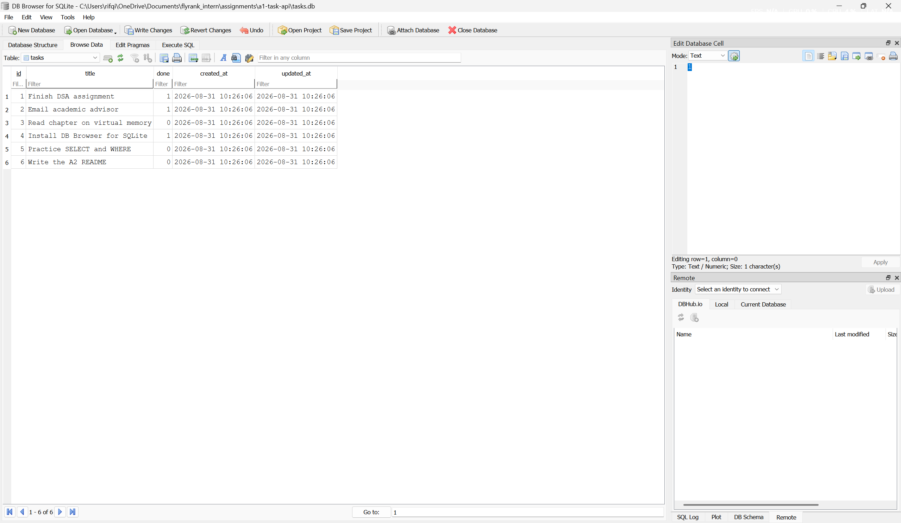

# Task API

A small REST API that manages a to-do list, backed by a SQLite database. It
supports the four CRUD operations, documents itself with Swagger UI, and its
data survives a restart because it lives in a file on disk rather than in the
program's memory.

Built for the FlyRank internship, Backend track — Assignment A1 (Week 2, the
API) and Assignment A2 (Week 3, the database).

Stack: Node.js + Express 5, `better-sqlite3` for storage, a hand-written
OpenAPI 3.0 document rendered by `swagger-ui-express`, and contract tests on
Node's built-in test runner.

## Run it

```bash
npm install
npm start
```

That is the only command. The server listens on `http://localhost:3000` and
interactive docs are at `http://localhost:3000/docs`.

There is no database setup step. On first run the app creates `tasks.db`,
creates the `tasks` table, and inserts three example tasks. A fresh clone works
immediately.

```bash
npm test          # the API contract tests
npm run dev       # restart automatically on file changes
PORT=4000 npm start
DB_FILE=/tmp/other.db npm start
```

## Why SQLite

- **It is one file.** `tasks.db` is the entire database. No server process to
  install, start, or keep running, and no connection string to configure.
- **Zero setup for whoever clones this.** Opening a SQLite path that does not
  exist creates it, so the "install the database" step that normally comes with
  Postgres or MySQL does not exist here.
- **The data survives.** That is the whole reason for this assignment. In A1 a
  restart wiped every task; now the rows are on disk and outlive the process.
- **It is real SQL.** Tables, indexes, transactions, query plans — the same
  concepts and mostly the same syntax as Postgres, without the setup cost.

The trade-off is that SQLite is a library reading a local file, not a server
reachable over a network. One machine can use it; a fleet of application servers
cannot share it. That is the boundary where Postgres starts to make sense.

## Where the data lives

| | |
|---|---|
| File | `tasks.db` in the project root |
| Created | Automatically, on first run |
| Committed to git? | **No** — it is in `.gitignore` |
| Override the path | `DB_FILE=/some/other.db npm start` |

The database is git-ignored on purpose: it is generated state, not source code.
Every clone builds its own from the schema and gets the same three seed tasks,
which is why a stranger can run this without being handed a file. SQLite in WAL
mode also writes `tasks.db-wal` and `tasks.db-shm` alongside it; both are
ignored too.

## Schema

```sql
CREATE TABLE IF NOT EXISTS tasks (
  id    INTEGER PRIMARY KEY AUTOINCREMENT,
  title TEXT    NOT NULL,
  done  INTEGER NOT NULL DEFAULT 0 CHECK (done IN (0, 1)),
  created_at TEXT,
  updated_at TEXT
);

CREATE INDEX IF NOT EXISTS idx_tasks_done ON tasks (done);
```

Three decisions worth explaining:

**`AUTOINCREMENT`, not a bare `INTEGER PRIMARY KEY`.** Without it SQLite reuses
the highest rowid once that row is deleted, so a new task could be handed the id
of one just removed. `AUTOINCREMENT` keeps the "ids are never reused" behaviour
the in-memory version had.

**`done` is an `INTEGER`.** SQLite has no boolean type. The `CHECK` constraint
keeps anything other than `0` or `1` out of the column, whatever writes to it.
The storage layer maps it back to a real JSON boolean on the way out, which is
what keeps the API's responses identical to A1's.

**`created_at` and `updated_at` are stored but deliberately not returned by the
API.** A2 requires the same response shapes as A1, and adding fields — even
harmless ones — would change them. The columns are populated on every insert and
update, ready to expose whenever a client actually needs them.

### What the index is for

An index is a sorted structure the database can seek into instead of reading
every row. `EXPLAIN QUERY PLAN` shows it working, and shows where it would not:

```
WHERE done = 1          ->  SEARCH tasks USING INDEX idx_tasks_done (done=?)
WHERE title LIKE '%x%'  ->  SCAN tasks
```

There is intentionally no index on `title`. The search filter uses a leading
`%` wildcard, which gives an index no prefix to seek on — SQLite would scan the
whole index rather than the whole table and save nothing. Making that column
fast needs full-text search (FTS5), not another index.

### Why the seed runs in a transaction

Counting the rows and inserting the three examples happen inside one
`db.transaction()`. Without it, two servers starting at the same moment could
both read a count of `0` and both insert, leaving six example tasks. Wrapped, it
is all-or-nothing: either the table gets exactly three seed rows, or none.

## Endpoints

Identical to Assignment 1. Only the storage behind them changed.

| Method | Path | Purpose | Success | Errors |
|---|---|---|---|---|
| GET | `/` | What this API is | 200 | — |
| GET | `/health` | Liveness check | 200 | — |
| GET | `/tasks` | List tasks | 200 | 400 invalid query |
| GET | `/tasks/:id` | Get one task | 200 | 404 unknown id |
| POST | `/tasks` | Create a task | 201 | 400 invalid body |
| PUT | `/tasks/:id` | Update a task | 200 | 400 invalid body, 404 unknown id |
| DELETE | `/tasks/:id` | Delete a task | 204 | 404 unknown id |
| GET | `/stats` | Counts of total / done / open | 200 | — |
| POST | `/reset` | Restore the three seed tasks | 200 | — |

A task on the wire:

```json
{ "id": 1, "title": "Finish DSA assignment", "done": false }
```

### Query parameters on `/tasks`

Filtering happens in SQL now, not in a JavaScript loop.

| Parameter | Example | SQL behind it |
|---|---|---|
| `done` | `/tasks?done=true` | `WHERE done = ?` |
| `search` | `/tasks?search=memory` | `WHERE title LIKE ?` |
| `sort` | `/tasks?sort=title` | `ORDER BY title COLLATE NOCASE` |

The `%` and `_` characters in a search term are escaped before they reach
`LIKE`, so searching for `50%` finds that literal text instead of matching every
row in the table.

### Validation rules

Unchanged from A1. `POST` needs a non-empty `title`; `PUT` needs at least one of
`title` or `done`, with `done` a real boolean rather than the string `"true"`;
titles are trimmed; the client never chooses `id` or the initial `done`; and a
body that is not valid JSON returns 400 rather than crashing.

## Every query is parameterized

No user input is ever glued into a SQL string. Values travel to SQLite
separately from the SQL text, as bound `?` parameters:

```js
db.prepare('SELECT id, title, done FROM tasks WHERE id = ?').get(id);
```

An id of `1; DROP TABLE tasks` is therefore looked up as a meaningless string
rather than executed. The one place SQL text is assembled in JavaScript is the
optional `WHERE` clause on `/tasks`, and there only fixed fragments the storage
layer owns are concatenated — the values still bind. Building the *structure* of
a query is safe; interpolating a *value* into it is what gets databases dropped.

## SQL run by hand

Stage 4, run directly against `tasks.db`. Full transcript in
[docs/sql-by-hand.txt](docs/sql-by-hand.txt).

```sql
SELECT * FROM tasks WHERE done = 1;
```

That returned a single row — `2 | Email academic advisor | done=1` — the only
seeded task that starts out completed.

The lesson from that stage came from the next query. `UPDATE tasks SET done = 1;`
reported **3 rows changed**, not one: with no `WHERE` clause a statement applies
to every row in the table. The same omission on a `DELETE` empties it, and there
is no undo.

## Proof it is the same file

With the server running and never restarted, a separate process opened
`tasks.db` and ran `UPDATE tasks SET done = 1`. The very next `GET /tasks`
returned all three tasks as `"done": true`. Then `DELETE FROM tasks WHERE done = 1`
from that same outside process, and `GET /tasks` returned `[]`.

There is no syncing step and no cache to invalidate. DB Browser, the hand-run
SQL, and the API are three readers of one file, and that file is the single
source of truth.

## Proof the API did not change

`test/api.test.js` describes the A1 contract — the endpoints, the status codes,
and the exact key set of every response body. Not one test mentions SQLite, a
table, or an array.

```
$ npm test
✔ every task has exactly id, title and done — and done is a real boolean
✔ POST /tasks ignores a client-supplied id and done
✔ PUT /tasks/:id can set done back to false
✔ DELETE /tasks/:id returns 204 with a genuinely empty body
✔ a malformed JSON body is the client's fault, not a 500
✔ data written by one process is visible to the next one
ℹ tests 24
ℹ pass 24
ℹ fail 0
```

Those same tests passing against both an array and a database is the actual
proof that storage is an implementation detail. The tests describe the promise;
the storage layer is only one way of keeping it. When A3 swaps SQLite for
Postgres this suite should still pass untouched — and if it does not, the
migration broke the contract and the tests will say exactly where.

The last test is the interesting one. `data written by one process is visible to
the next one` starts the server, creates a task, kills the process, starts a
fresh one, and asks for the task again. In A1 that test could not have been
written.

## A full lifecycle, via curl

```text
$ curl -i -X POST http://localhost:3000/tasks \
    -H "Content-Type: application/json" \
    -d '{"title":"Review pointer arithmetic notes"}'
HTTP/1.1 201 Created
Content-Type: application/json; charset=utf-8

{"id":4,"title":"Review pointer arithmetic notes","done":false}

$ curl -i -X PUT http://localhost:3000/tasks/4 \
    -H "Content-Type: application/json" -d '{"done":true}'
HTTP/1.1 200 OK
Content-Type: application/json; charset=utf-8

{"id":4,"title":"Review pointer arithmetic notes","done":true}

$ curl -i -X DELETE http://localhost:3000/tasks/4
HTTP/1.1 204 No Content

$ curl -i http://localhost:3000/tasks/4
HTTP/1.1 404 Not Found
Content-Type: application/json; charset=utf-8

{"error":"Task 4 not found"}
```

Full transcript: [docs/curl-session.txt](docs/curl-session.txt).

## Swagger UI


## The database in DB Browser

The same rows the API serves, opened straight from `tasks.db`:



## On changing the table's shape

Adding `created_at` and `updated_at` to a table that already held rows was the
most awkward part of this assignment. SQLite rejects
`ADD COLUMN ... NOT NULL DEFAULT CURRENT_TIMESTAMP`, because the default has to
be a constant and every existing row would need a different value — so one
conceptual change became three steps: add the column nullable, backfill the rows
already there, then have the application populate it from then on. And that
whole sequence has to be guarded by a check of the current columns, or it re-runs
on the next startup and fails.

Doing it by hand once makes it obvious why migration tools exist. A schema is not
a file you edit; it is an ordered list of changes that has to stay replayable
against a database already holding real data.

## Project layout

```
index.js           HTTP layer — routes, validation, status codes. Knows no SQL.
db.js              Storage layer — the only file that knows SQL exists.
openapi.json       The OpenAPI 3.0 description Swagger UI renders.
test/api.test.js   The A1 contract, asserted against the database.
docs/              Screenshots and terminal transcripts.
tasks.db           Created on first run. Git-ignored.
```

The split is the point. `index.js` reads requests and writes responses; `db.js`
owns every `SELECT`, `INSERT`, `UPDATE` and `DELETE`. Moving from an array to
SQLite changed `db.js` and the handful of lines in `index.js` that call it —
never the validation, the status codes, or the response shapes. When A3 swaps
SQLite for Postgres, `db.js` is the file that changes.
