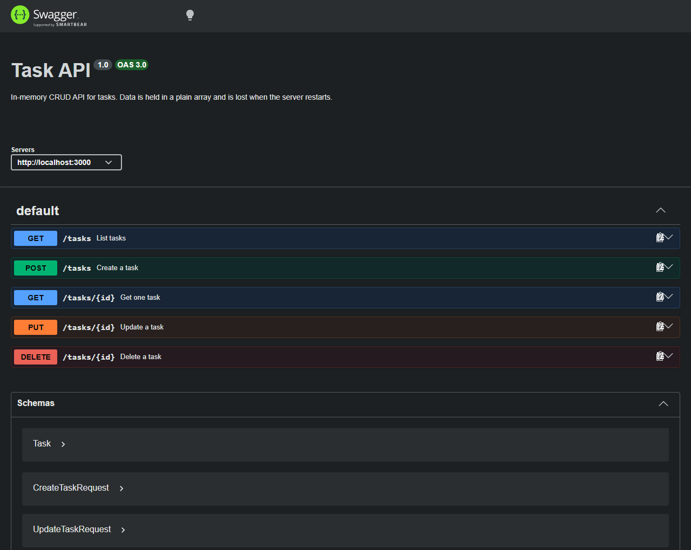

# Task API

A small REST API that manages a to-do list. It supports the four CRUD
operations over an in-memory list of tasks, documents itself with Swagger UI,
and has no database — tasks live in a JavaScript array and are lost when the
process stops.

Built for the FlyRank internship, Backend track, Week 2, Assignment A1.

Stack: Node.js + Express 5, documented with `swagger-ui-express` and a
hand-written OpenAPI 3.0 document.

## Run it

```bash
npm install
npm start
```

The server listens on `http://localhost:3000`. Interactive docs are at
`http://localhost:3000/docs`.

Use `npm run dev` instead of `npm start` to restart automatically on file
changes. Set `PORT` to listen elsewhere: `PORT=4000 npm start`.

## Endpoints

| Method | Path | Purpose | Success | Errors |
|---|---|---|---|---|
| GET | `/` | What this API is | 200 | — |
| GET | `/health` | Liveness check | 200 | — |
| GET | `/tasks` | List tasks | 200 | 400 invalid query |
| GET | `/tasks/:id` | Get one task | 200 | 404 unknown id |
| POST | `/tasks` | Create a task | 201 | 400 invalid body |
| PUT | `/tasks/:id` | Update a task | 200 | 400 invalid body, 404 unknown id |
| DELETE | `/tasks/:id` | Delete a task | 204 | 404 unknown id |
| GET | `/stats` | Counts of total / done / open | 200 | — |
| POST | `/reset` | Restore the three seed tasks | 200 | — |

A task looks like this:

```json
{ "id": 1, "title": "Buy groceries", "done": false }
```

### Query parameters on `/tasks`

| Parameter | Example | Effect |
|---|---|---|
| `done` | `/tasks?done=true` | Only finished tasks. Must be `true` or `false`. |
| `search` | `/tasks?search=milk` | Only tasks whose title contains the word, case-insensitive. |

Both can be combined: `/tasks?done=false&search=milk`.

### Validation rules

- `POST /tasks` requires `title` to be present and non-empty after trimming.
- `PUT /tasks/:id` requires at least one of `title` or `done`. `title` cannot
  be empty; `done` must be a real boolean, not the string `"true"`.
- Titles are trimmed before they are stored.
- A body that is not valid JSON returns 400, not a crash.

## A full lifecycle, via curl

Create, read, update, delete, then confirm it is gone — with the status code
visible at each step:

```text
$ curl -i -X POST http://localhost:3000/tasks \
    -H "Content-Type: application/json" \
    -d '{"title":"Buy milk"}'
HTTP/1.1 201 Created
Content-Type: application/json; charset=utf-8

{"id":4,"title":"Buy milk","done":false}

$ curl -i http://localhost:3000/tasks/4
HTTP/1.1 200 OK
Content-Type: application/json; charset=utf-8

{"id":4,"title":"Buy milk","done":false}

$ curl -i -X PUT http://localhost:3000/tasks/4 \
    -H "Content-Type: application/json" -d '{"done":true}'
HTTP/1.1 200 OK
Content-Type: application/json; charset=utf-8

{"id":4,"title":"Buy milk","done":true}

$ curl -i -X DELETE http://localhost:3000/tasks/4
HTTP/1.1 204 No Content

$ curl -i http://localhost:3000/tasks/4
HTTP/1.1 404 Not Found
Content-Type: application/json; charset=utf-8

{"error":"Task 4 not found"}
```

The full transcript is in [docs/curl-session.txt](docs/curl-session.txt).

## Swagger UI

Every endpoint is listed at `/docs`, and each one has a "Try it out" button
that sends a real request to the running server.



## What happens on restart

I created a task called "Survive a restart", confirmed it was in `GET /tasks`,
stopped the server, started it again, and asked for the list once more — the
task was gone and only the three seed tasks came back.

That happens because `tasks` is an ordinary JavaScript array living in the
process's heap. When the process exits, the operating system reclaims every
page of memory it owned, and nothing was ever written anywhere that outlives
it. A database is what fixes this: it writes to disk, so the data survives the
process that created it.

## Project layout

```
index.js        the whole API — routes, validation, and the in-memory store
openapi.json    the OpenAPI 3.0 description that Swagger UI renders
docs/           the Swagger screenshot and the curl transcript
```
